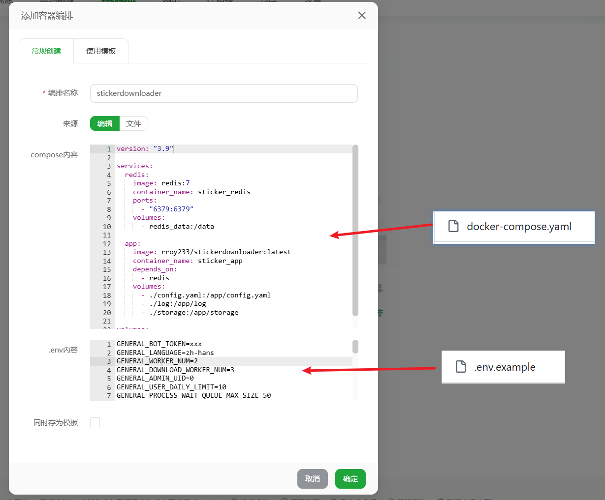
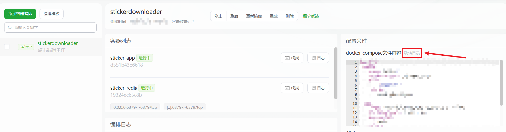

# 🗼 StickerDownloader Linux宝塔面板一键部署教程

---

## 🧰 准备前提

* 安装：宝塔面板（教程使用版本11.1.0）
* 在宝塔面板中：安装Docker环境

**镜像源选择**

| 镜像仓库                      | 镜像地址格式                                                     |
| ------------------------- |------------------------------------------------------------|
| Docker Hub                | `docker.io/rroy233/stickerdownloader`                      |
| GitHub Container Registry | `ghcr.io/rroy233/stickerdownloader`                       |
| 阿里云镜像仓库                   | `registry.cn-guangzhou.aliyuncs.com/rroy233/stickerdownloader` |

(本教程默认使用Docker Hub作为镜像仓库)

---

## ✅ 部署流程

---

1. 在宝塔面板侧边栏选择「Docker」，点击「容器编排」选项栏，点击「添加容器编排」按钮。

2. 将仓库根目录下的`docker-compose.yaml`文件内容填入「compose内容」文本框中。

 - 可以修改`docker-compose.yaml`中的镜像源（默认为Dockerhub）、image版本号（默认为`latest`）。
 - 修改`.env`各配置项，如`GENERAL_BOT_TOKEN`、`GENERAL_ADMIN_UID`等。

3. 点击「确认」创建容器编排，即可完成部署。

可以看到两个容器都启动起来了。点击「跳转目录」可以查看日志等文件。

